**Advanced Lane Finding Project**

代码提交采用Jupyter notebook进行，因此提交代码中已包含部分讲解和中间过程结果；本writeup再次详细描述。

The goals / steps of this project are the following:

* Compute the camera calibration matrix and distortion coefficients given a set of chessboard images.
* Apply a distortion correction to raw images.
* Use color transforms, gradients, etc., to create a thresholded binary image.
* Apply a perspective transform to rectify binary image ("birds-eye view").
* Detect lane pixels and fit to find the lane boundary.
* Determine the curvature of the lane and vehicle position with respect to center.
* Warp the detected lane boundaries back onto the original image.
* Output visual display of the lane boundaries and numerical estimation of lane curvature and vehicle position.

## Camera Calibration
摄像机畸变校正主要采用cv2.calibrateCamera方法进行校正处理，其主要方法是采用畸变图片中的像素坐标与其对应真实的（即校正后）坐标进行反向求取畸变参数，然后采用获取的畸变参数对畸变的图片采用‘cv2.undistort’进行畸变校正，从而可获取校正后的图片。对应代码在"./work.ipynb"中的in3～in4步骤，其中畸变参数获取方法如下：

* 首先，采用"./camera_cal/"文件夹下提供的20张不同角度下获取棋盘格的图片，由于棋盘图片的简单性，容易获取其中的角点，可采用‘cv2.findChessboardCorners’找到20张图片中每个图片中的所有角点作为畸变图片的坐标并放入‘imgpoints’中。而每个角点对应的真实环境的坐标为[x,y,z]三维空间，映射平面内，因此其中z坐标应恒等于0。由于真实环境中棋盘大小完全一致，因此角点横向和纵向完全是等间距排列，同时从棋盘格图片可看出横向和纵向分别有9和6个角点，故可假设对应真实坐标为[0,0,0][1,0,0]....[8,0,0]...[8,5,0],然后对应每张图片放入‘objpoints’中；
* 根据20张图片的‘imgpoints’和对应真实环境‘objpoints’，采用‘cv2.calibrateCamera’方法获取畸变参数mtx, dist；
* 根据畸变参数mtx, dist和原图采用‘cv2.undistort’方法获取校正后图像；

下图为寻找角点的原图和校正后的图

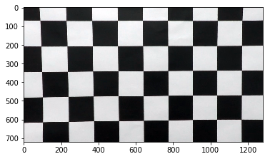

## Pipeline 采用一张例图
### 获取修正后的车道线图片
根据摄像畸变修正步骤获取的畸变参数，采用‘cv2.undistort’方法对"test_images/straight_lines1.jpg"图片进行畸变校正，对应代码在"./work.ipynb"中的in7～in8步骤，获取校正前后图像如图所示。

### 视角转换成鸟瞰图
获取校正后图片，在图片上的左右车道线，各取上下2个点，可采用鼠标放大图片后获取，共四个点坐标([260,678],[595,450],[684,450],[1041,678])的梯形，并放入src；而在真实环境鸟瞰图视角下对应的四个点为一个矩形，故可假设真实环境对应的点为[300,720],[300,0],[900,0],[900,720]并放入dst；通过两个视角下对应的4组坐标值采用‘cv2.getPerspectiveTransform’可获取视角转换参数M，并通过'cv2.warpPerspective'方法将原视角图像转换成鸟瞰图。对应代码在"./work.ipynb"中的in9～in11步骤，其原图和转换后的鸟瞰图如图所示：
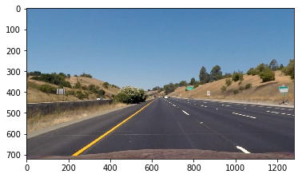
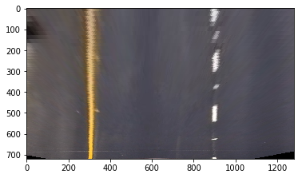

### 车道线特征点提取

根据培训资料可知，有多种方法可提取相关特征，而本人采用三种种方法融合的方法，包括：
* 采用梯度sobel算子
* 采用HLS色彩空间
* 采用黄色色彩空间;

#### 梯度特征
根据教学和练习可知，车道线主要是垂直的，因此梯度特征应采用sobelx索贝尔算子求取， 对应代码在"./work.ipynb"中的in12～in13步骤，其sobelx特征图如所示；
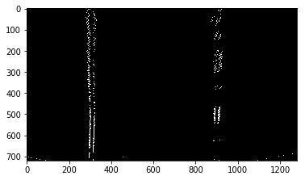

####  HLS色彩空间计算特征
由于受天气、遮挡、阴影等原因，导致图像明亮不定，故单独的灰度梯度方法无法区分真实车道线还是阴影，而采用HLS空间的S通道表示颜色饱和度，不关心亮度，因此可以很好提取颜色的深度，而车道线基本为黄色和白色的深色，通过课件和练习可知其中S通道效果最佳；对应代码在"./work.ipynb"中的in14～in16步骤，其s通道特征图如所示；
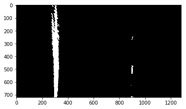

#### 黄色空间特征：
采用上面两种特征进行融合，“./test_images”文件下例图大部分均可以很好检测出车道线，但是其中图“test_images/test1.jpg” 和 “test_images/test4.jpg“效果不佳。其中图“test_images/test4.jpg”上面两种特征图如图所示：
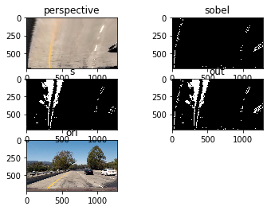

显然黄色的车道线，效果不好，因此需要考虑增加黄色空间的检测。对应代码在"./work.ipynb"中的in15步骤，其黄色空间对应效果如图所示。有一定改善。
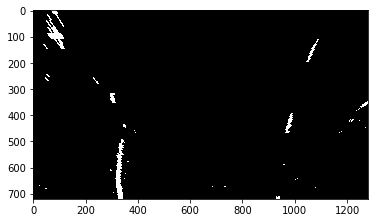

#### 三种特征组合
将获取的鸟瞰图经过三种特征提取，并将其进行或操作，从而获取融合后的特征图，对应代码在"./work.ipynb"中的in20步骤，其处理原图、每种特征图、组合特征图如图所示：
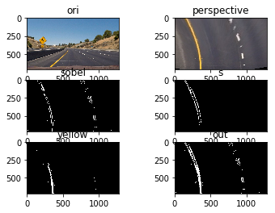

### 动态滑窗获取车道线上主要特征点
采用滑窗获取车道线大致位置的思想如下：
* 在提取的车道线特征图（如下图）可明显看出，车道线主要沿垂直方向分布，因此可以将图像以垂直方向进行统计特征点个数，并画直方图，如图所示，显然其中的两个波峰便是左右车道线在水平方向，即x轴的位置；

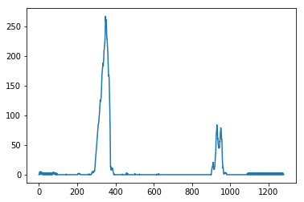
* 由于车道线毕竟不一定完全垂直，为更精确获取车道线特征点在x轴方向分布，可将图片沿垂直方向等间隔采样，我将其等分为9份；可求每一份的直方图波峰，即为每段车道线大约位置；
* 由于特征点存在一定噪点，因此每一份直方图波峰并不一定完全准确；考虑到一张图片中的车道线应是连续的，且宽度具有一定范围，可采用此条件限制求取直方图的更精确的范围；
* 假设已知图片底部作为第一份，其车道线在x轴方向的位置，并设置左右范围和其上下边界可组成一个矩形框，其中矩形框内的特征点可认为为车道线特征点，并统计其特征点在x轴的主要分布，作为下个相邻的一份其车道线在X轴方向的位置；
* 按照上一步骤以此计算完9份即9个矩形框中所有的特征点；

依据以上滑窗思想，获取车道线特征点代码参考"./work.ipynb"中的in24步骤，具体操纵步骤如下：

1. 求取最底部的一份左右车道线在x轴方向大约位置；并且为提高可靠性，并降低错误点，首先采用图片底部的一半的图片求取直方图，获取到两个波峰的位置，即为左右车道线第一份特征点主要位置；
2. 将图片在垂直方向等分9份，确定每一份的垂直方向边界；
3. 设置车道线中心位置左右分布范围边界；
4. 分别记录所有矩形框内所有特征点；
5. 分布统计左右矩形框内特征点个数，并判断其个数是否超出阈值；若超出阈值则更新其车道线中心位置；
6. 更新垂直方向上的边界；
7. 重复3～6步骤，直到9份全部计算结束；
8. 获取整个图片中左右车道线特征点坐标。
其获取图片左右车道线特征点示意图如图所示，其中左右特征点用颜色区分。
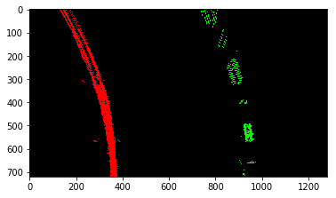

### 多项式拟合
根据教程可知，车道线可采用２次多项式进行拟合，形成曲线方程，其曲线方程则近似为车道线。根据动态滑窗方法获取的左右车道线上特征点坐标，采用‘np.polyfit’可求取多项式方程；由于车道线主要是垂直方向，X轴坐标变化较小，因此多项式采用$ f(y) = Ay^2+By+C$表示。
根据多项式和图片垂直方向的y坐标求出左右车道线坐标，代码参考"./work.ipynb"中的in29步骤，车道线效果图如图所示；
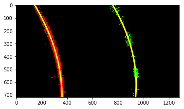

### 还原至原观测角度方向并显示在原图片上
经过视角转换成鸟瞰图，从而检测出的左右车道线的坐标位置，其坐标也是鸟瞰图视角下的，因此需要还原至原始视角的图片上。其代码参考 "./work.ipynb"中的in36步骤。
1. 首先依据左右车道线上的坐标集合，并采用教程中提供的“cv2.fillPoly”方法构建一份车道线覆盖区域的图片；
2. 将鸟瞰图片采用"./work.ipynb"中的in10中方法，反向转换回原来视角图片（即将视角转换成鸟瞰图步骤中的src和dst的4组坐标调换）。
3. 采用‘cv2.addWeighted’方法将原图与车道线覆盖区域图融合；

其结果图如图所示：
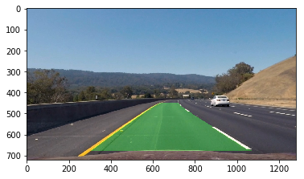

### 获取车道线上主要特征点另一种方法

采用动态滑窗方法，相当于遍历整个图像，如果是一张单独照片，需要如此方法，但是由于汽车观测的视频相邻的两帧照片区别不大，因此车道线的位置不会有太大的变化。可以采用如此可以用上一帧的计算的车道线多项式，然后直接扩展出有效车道线范围内，进行查找新的一帧车道线的点。如此相对于每次遍历整张图片每个窗口，效率有较大提高。

其代码参考"./work.ipynb"中的in32步骤，其执行步骤如下：
1. 设置车道线中心左右范围； 
2. 根据已知左右车道线多项式方程，分别求出每个y轴方向对应x的坐标；
3. 统计在此y轴上对应x有效范围内的特征点；
4. 统计所有左右车道线特征点坐标；

### 曲率
由于车道线采用多项式拟合，因此可根据多项式表达式，求出其曲率。
其多项式为
$ f(y) = Ay^2+By+C\text {，多项式} $。

则曲率为
$ R = \frac{[1+(\frac{dx}{dy})^2]^3/2}{|\frac{d^2x}{dy^2}|}\text {，曲率} $。

化简可得
$ R = \frac{[1+(2Ay + B)^2]^3/2}{|2A|}\text {，曲率} $。

其中y应当取图像最底部的值，因为离车最近，才是汽车目前所在位置的车道线曲率，其中y=img.shape[0]

由于目前计算的曲率是以图片像素单位计算的，但在真实环境下的曲率应当根据像素对应实际对应的距离进行换算。从上图中实际车道线的宽度和长度，以及参考教学课件可知。可近似认为车道宽度为3.7m，对应像素个数约为550; 车道长度为30m，对应车道线为720像素点。应将图片中车道线上点像素坐标转换为真实坐标，然后进行再曲线拟合并曲率计算；其代码参考为 "./work.ipynb"中的in34函数；

### 偏移量
由于假设摄像机安装位置在汽车中心，因此图像的中心线则为汽车中心，而图像中心距离左右车道线中心的位置则为汽车偏移量。因此可先根据真实环境的多项式求出左右车道线在图片底部的x轴坐标和图片中心对应真实环境坐标的x轴，其代码参考 "./work.ipynb"中的in34步骤中最后3行代码；其中偏移量offset为正，表明汽车向右偏移，否则向左偏移；

### 采用视频进行车道线检测
* 采用‘cv2.VideoCapture’获取project_video中每一帧图片，进行上述的pipeline处理并输出车道线覆盖区域与原图融合的图片；
* 同时为提高处理速度，视频中第一帧图片采用滑窗方法获取左右车道线特征点范围提取，而接下来每一帧采用上帧的车道线结果提取本帧图片车道线特征点范围，获取车道线多项式。
* 计算每一张图片中左右车道线的曲率和汽车的偏离量，并将其值采用‘cv2.putText’打印至图片上;
* 将每一帧的结果图片采用‘cv2.VideoWriter’保存视频。
以上操作步骤，其代码参考 "./work.ipynb"中的步骤in41。其输出处理后的视频链接
[link to my video result](./output_images/project_video1.mp4)

（如不能播放，请到作业文件下的output_images/project_video1.mp4进行播放。）

## 讨论
本次作业的采用的技术和方法，基本全部参考教学视频提供的方法。其中整个车道线检测过程中，车道线特征点提取这一环节为认为最为复杂和灵活性较高，不同的提取方案如梯度法、色彩空间等，都有一定优点和缺点，因此需要配合使用互相弥补其缺点。
即使融合多种方法，但每种方法中的均有相关参数需要调节，每个参数都需要设置合理，则车道线才能被稳定检测出来；
由于我目前虽然采用梯度法、色彩空间中的饱和度和颜色三种检测方法，但其参数是根据提供参考图片多次尝试获取的，且是固定的，因此稳定性稍差。因此在有阴影或图片过亮或过案时，仍然存在检测错误的可能；
本人认为，需要收集更多的不同情况下车道线照片，分别尝试获取对应的参数，而后续的车道线特征点检测时每种方法的参数也应根据图片的环境情况，进行动态调整参数，则检测能力会更加稳定；